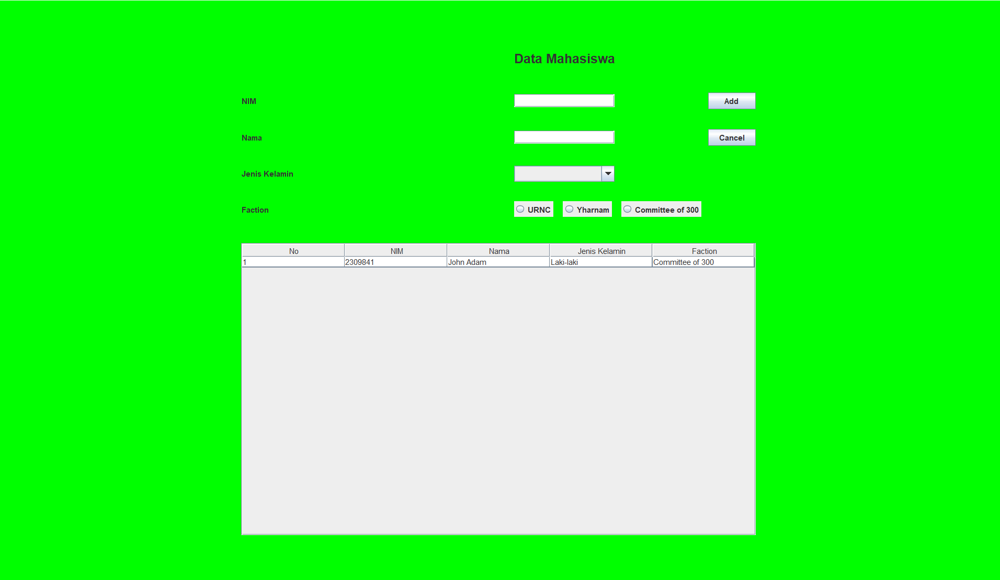
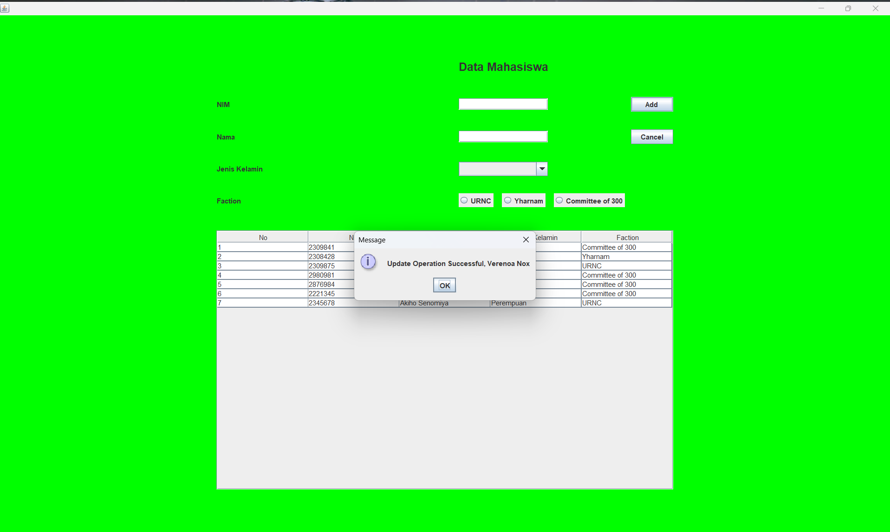
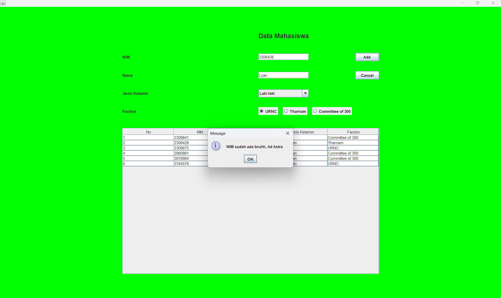

## Janji

Saya Lyan Nazhabil Dzuquwwa dengan NIM 2308428 mengerjakan Tugas Praktikum 5 dalam mata kuliah Desain dan Pemrograman Berorientasi Objek untuk keberkahanNya maka saya tidak melakukan kecurangan seperti yang telah dispesifikasikan. Aamiin.

## Desain Program
Program terdiri dari 1 class, yaitu class **Mahasiswa**. Class ini memiliki 3 atribut awal yaitu:
1. nim
2. nama
3. jenisKelamin
   lalu sesuai dengan spesifikasi soal, ditambahkan 1 atribut lagi yaitu atribut ``faction``

Program ini juga memiliki koneksi dengan database MySQL dengan database bernama ``db_mahasiswa`` dan tabel bernama ``mahasiswa`` yang digambarkan dengan kelas Database yang berisi:
1. method ``getStatement()`` untuk mendapatkan statement
2. method ``selectQuery(String sql)`` untuk mengeksekusi query **SELECT** dan mengembalikan nilai berupa hasil query tersebut
3. method ``insertUpdateDeleteQuery`` untuk mengeksekusi query **INSERT, UPDATE, DELETE** dan mengembalikan nilai yang menunjukkan apakah query berhasil dijalankan atau tidak

## Alur Program
1. Saat program dijalankan, akan muncul window. Saat window baru muncul, akan tampil data data mahasiswa, 4 kolom sesuai atribut, dan 2 action yaitu ``Add`` dan ``Cancel``.
2. Jika ingin menambahkan data, isi field terlebih dahulu lalu tekan ``Add``, data akan berhasil ditambahkan
3. Jika ingin menghapus data, pilih salah satu data mahasiswa yang ingin dihapus dengan cara mengarahkan cursor ke data tersebut lalu diklik
4. Setelah itu, akan muncul 3 action yaitu ``Update``, ``Cancel``, dan ``Delete``. Karena ingin menghapus data, klik ``Delete``
5. Setelah itu akan muncul comfirmation prompt untuk mengonfirmasi apakah benar ingin menghapus data atau tidak. Jika iya, maka data akan berhasil dihapus.
6. Jika melakukan proses ``Add`` atau ``Update`` namun sudah terdapat nim yang sama, maka akan muncul error message dan data tidak akan berhasil ditambahkan atau diupdate.
7. Jika melakukan proses ``Add`` atau ``Update`` namun field masih kosong, maka akan muncul error message dan data tidak akan berhasil ditambahkan atau diupdate.

## Dokumentasi

